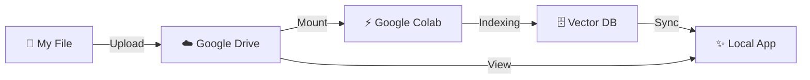

# ☁️ Theology AI Lab v4.0 (Cloud Edition)

> **"무거운 처리는 클라우드에서, 검색은 내 맥북에서."**

개인용 AI 기반 신학 연구 도구의 완성형입니다.  
**Google Colab**의 강력한 GPU로 수천 페이지의 신학 서적(PDF)을 인덱싱하고,  
**Local Streamlit App**으로 내 서재처럼 쾌적하게 검색하세요.



---

## ✨ 핵심 기능

1.  **🏭 Cloud Indexing Factory**: 
    - 내 로컬 컴퓨터를 혹사시키지 마세요.
    - **Google Colab (T4 GPU)**를 사용하여 무료로, 빠르게 인덱싱합니다.
    - PDF, EPUB, TXT 등 다양한 형식을 지원합니다.

2.  **☁️ Cloud Storage**:
    - 모든 데이터(원본, 벡터 DB)는 **Google Drive**에 안전하게 저장됩니다.
    - 사무실, 집, 카페 어디서든 같은 데이터를 공유합니다.

3.  **🖥️ Local Insight Viewer**:
    - 가볍고 빠른 로컬 앱(Streamlit)에서 데이터를 검색합니다.
    - **3중 언어 확장** (한글 질문 → 독어/영어 검색)
    - **듀얼 검색** (Vector + Keyword)

---

## 🛠️ 설치 및 설정 (10분 완성)

### 1단계: 구글 드라이브 준비
1. 구글 드라이브에 `Theology_AI_LAB` 폴더를 만듭니다.
2. 다음 구조로 폴더를 만듭니다:
   ```text
   Theology_AI_LAB/
   ├── 01_Library/
   │   ├── inbox/      (여기에 PDF를 넣으세요)
   │   └── archive/    (자동 생성됨)
   └── 02_Brain/
       └── vector_db/  (자동 생성됨)
   ```

### 2단계: 클라우드 인덱서 준비
1. 제공된 `Theology_AI_Cloud_Indexer.ipynb` 파일을 구글 드라이브 `Theology_AI_LAB` 폴더에 넣습니다.

### 3단계: 로컬 뷰어 설정
1. 이 저장소를 로컬(Mac/PC)에 다운로드합니다.
2. **설치 스크립트 실행** (최초 1회):
   - 🍎 Mac: `1_INSTALL_MAC.command`
   - 🪟 Win: `1_INSTALL_WIN.bat`
3. **앱 실행**:
   - 🍎 Mac: `3_START_MAC.command`
   - 🪟 Win: `3_START_WIN.bat`
4. **클라우드 연결** (최초 실행 시):
   - 앱 내 **⚙️ 설정** 탭으로 이동
   - **클라우드 연결 마법사**에서 구글 드라이브 경로 입력 및 연결

---

## 🚀 사용 흐름 (Workflow)

### 1. 자료 등록 (In the Cloud)
1. **Drop**: PDF 파일을 로컬의 `inbox` 폴더에 넣습니다. (구글 드라이브 자동 동기화)
2. **Run**: [Google Colab](https://colab.research.google.com)에서 `Theology_AI_Cloud_Indexer.ipynb`를 열고 **`모두 실행`**을 누릅니다.
3. **Done**: 인덱싱이 끝나면 파일이 `archive`로 이동합니다.

### 2. 자료 검색 (On Local)
1. **앱 실행**: `3_START_MAC` (또는 Windows용) 파일을 더블클릭합니다.
2. **검색**: 브라우저가 열리면 검색창에 질문을 입력하세요.
   - *팁: 실행 파일을 바탕화면에 두고 **앱 아이콘처럼** 쓰세요. 창을 닫아도 다시 누르면 열립니다.*
3. **활용**: AI 리포트 생성, Obsidian 내보내기 등을 수행합니다.

---

## 🏗️ 폴더 구조

```text
Theology_AI_Lab_v4/         (로컬)
├── 03_System/              # 로컬 뷰어 소스 코드 (Streamlit)
├── 1_INSTALL_MAC.command   # 설치 스크립트
├── 3_START_MAC.command     # 실행 스크립트
├── Theology_AI_Cloud_Indexer.ipynb  # Colab 실행용 노트북
└── docs/                   # 상세 매뉴얼

Theology_AI_LAB/            (구글 드라이브)
├── 01_Library/
│   ├── inbox/              # 인덱싱 대기 파일
│   └── archive/            # 처리 완료 파일
├── 02_Brain/
│   └── vector_db/          # 벡터 데이터베이스
└── Theology_AI_Cloud_Indexer.ipynb
```

---

## 📝 라이센스 및 정보
- **Developer**: Kerygma Press (mitmirsein)
- **Version**: 4.0.0 Cloud Edition
