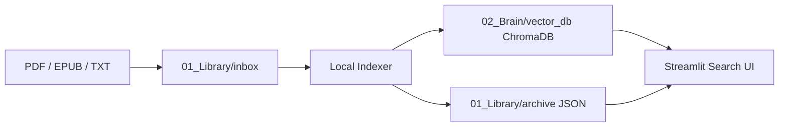

# Theology AI Lab

> 무거운 동기화 구조를 걷어내고, 한 컴퓨터 안에서 입고, 인덱싱, 검색까지 끝내는 로컬 신학 연구 도구입니다.

PDF/EPUB/TXT 자료를 `01_Library/inbox`에 넣고 Streamlit 앱에서 **로컬 인덱싱**을 실행하면, 결과는 `01_Library/archive`와 `02_Brain/vector_db`에 저장됩니다.


```mermaid
flowchart LR
    A[PDF / EPUB / TXT] --> B[01_Library/inbox]
    B --> C[Local Indexer]
    C --> D[01_Library/archive JSON]
    C --> E[02_Brain/vector_db ChromaDB]
    E --> F[Streamlit Search UI]
    D --> F
```

## 핵심 기능

1. **Local Indexing**
   - Google Drive와 Colab 없이 이 컴퓨터에서 직접 인덱싱합니다.
   - PDF, EPUB, TXT를 처리합니다.
   - 텍스트 레이어가 없는 PDF는 OCR 패키지가 준비된 경우 OCR fallback을 시도합니다.

2. **Local Storage**
   - 원본 대기 파일: `01_Library/inbox`
   - 청크 아카이브: `01_Library/archive`
   - 벡터 DB: `02_Brain/vector_db`

3. **Research UI**
   - Streamlit 기반 검색 앱
   - 3중 언어 확장
   - Vector + archive JSON 이중 검색
   - 선택적 Claude/GPT/Gemini 리포트 생성
   - Obsidian 내보내기

## 설치

### Mac

```bash
./1_INSTALL_MAC.command
```

### Windows

```bat
1_INSTALL_WIN.bat
```

설치 스크립트는 `03_System/venv` 가상환경을 만들고 필요한 Python 패키지를 설치한 뒤 로컬 서재 폴더를 생성합니다.

## 실행

### Mac

```bash
./3_START_MAC.command
```

### Windows

```bat
3_START_WIN.bat
```

브라우저에서 `http://localhost:8501`이 열립니다.

## 사용 흐름

1. `01_Library/inbox`에 PDF/EPUB/TXT 파일을 넣습니다.
2. 앱의 **Inbox** 탭에서 필요하면 저자, 제목, 연도, 실제 페이지 오프셋을 보정합니다.
3. **로컬 인덱싱 시작**을 누릅니다.
4. 인덱싱이 끝나면 파일별 archive JSON과 ChromaDB가 생성됩니다.
5. **검색** 탭에서 질의하고, 필요하면 리포트를 다운로드하거나 Obsidian에 저장합니다.

## 폴더 구조

```text
Theology_AI_Lab_v4/
├── 01_Library/
│   ├── inbox/              # 인덱싱 대기 파일
│   └── archive/            # 청킹 JSON 아카이브
├── 02_Brain/
│   └── vector_db/          # ChromaDB 벡터 데이터베이스
├── 03_System/              # Streamlit 앱과 로컬 인덱서
├── 1_INSTALL_MAC.command
├── 1_INSTALL_WIN.bat
├── 3_START_MAC.command
├── 3_START_WIN.bat
└── docs/
```

## 배포 상태

Local-first frozen baseline.
