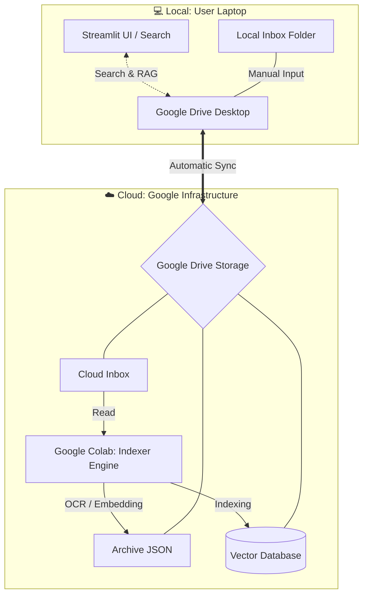

# 🏛️ Theology AI Lab v4.0 (Cloud Edition) 기술 명세서

> **작성자**: 비서실장 빼뽀네 (Peppone)  
> **버전**: v4.0.0 (Cloud Edition)  

---

## 0. 프로젝트 철학: 자린고비 서재 만들기

### 💡 배경: 로컬의 한계를 넘어서
개인 신학 디지털 서재 구축 프로젝트는 이제 안정 단계로 진입했습니다. 초기에는 "모든 것을 내 컴퓨터에서 직접 처리하겠다"는 생각으로 시작했지만, 곧 **로컬 환경의 물리적 한계**(고사양 GPU 부재, 스토리지 용량, 처리 속도)를 마주했습니다.

그 해법은 **"무거운 일은 클라우드에, 가벼운 일은 로컬에"** 라는 분리 전략이었습니다. 이는 단순한 기술적 선택이 아니라, **비용 제로(Zero-Cost)** 원칙을 지키면서도 고성능을 달성하기 위한 철학적 결정입니다.

### 💰 핵심 원칙: 어느 과정에도 비용이 들지 않는다
"자린고비 서재 만들기"의 핵심은 **비용이 드느냐, 안 드느냐**입니다. 이 프로젝트의 모든 단계—OCR, 청킹, 임베딩, 검색, 저장—는 **무료 도구와 무료 클라우드 티어**만으로 구현되었습니다.

*   **OCR & 인덱싱**: Google Colab 무료 T4 GPU
*   **임베딩 모델**: 오픈소스 BAAI/bge-m3 (구글 코랩 실행)
*   **스토리지**: Google Drive 15GB 무료 티어
*   **검색 엔진**: ChromaDB (오픈소스)
*   **AI 응답 (선택)**: API 키 비용 발생 가능, 하지만 **수동으로 우회 가능** (검색 결과 복사/파일 다운로드 → ChatGPT/Claude 웹 붙여넣기)

> "불특정 다수가 이용하는 서비스가 아니기에, 구글 드라이브의 데이터베이스 동기화가 깨질 위험을 감수하고 모험했습니다. 개인 연구 환경이라면 충분히 감당 가능한 트레이드오프입니다."

### 🔄 싱크의 마법: 구글 드라이브 데스크탑 앱
**리모트 서재(Google Drive)**와 **로컬 서재(내 컴퓨터)** 사이의 싱크는 **구글 드라이브 데스크탑 앱**이 자동으로 담당합니다. 사용자는 파일을 로컬 폴더에 넣기만 하면 클라우드로 자동 업로드되고, **구글 드라이브의 전용 Colab 노트북 파일을 열어 실행**하면 처리됩니다. 처리 결과(Vector DB, Archive JSON)는 다시 드라이브를 통해 로컬로 내려와 검색에 즉시 활용됩니다.

이 구조의 핵심은 **클라우드(구글 드라이브)는 무거운 임베딩 작업 때만 사용하고, 평소 검색은 내 컴퓨터(로컬)에서 빠르게 활용**할 수 있다는 점입니다.

---

## 1. 아키텍처: Hybrid Cloud Strategy (Heavy Cloud, Light Local)
컴퓨팅 자원과 저장소는 클라우드에, 사용자 경험은 로컬에 집중하는 하이브리드 전략입니다.

*   **☁️ The Engine (Google Colab & Drive)**
    *   **Role**: 고부하 인덱싱 엔진 (OCR, Chunking, Indexing).
    *   **Workflow**: 사용자가 파일을 Drive Inbox에 넣으면, 전용 **Google Colab 노트북/파일**을 실행하여 T4 GPU 가속을 통해 문헌을 신속하게 처리합니다.
    *   **Storage**: Google Drive를 모든 자료의 중심 보관소로 사용합니다.

*   **🖥️ The Interface (Local Streamlit)**
    *   **Role**: 경량화된 지휘 통제실 (Search & Chat).
    *   **Tech**: Python, Streamlit, ChromaDB (Client Mode).
    *   **Simplicity**: 무거운 ML 라이브러리(Torch, OCR 등)를 제거하여 가볍고 빠른 구동 속도를 보장합니다.

---

## 2. 검색 (RAG: Multi-Layered Intelligence)
단순한 벡터 검색을 넘어, 신학적 맥락과 다국어 환경을 고려한 통합 검색 시스템입니다.

### 🔍 Dual Search & Trilingual Expansion
*   **이중 검색 (Dual Search)**: 
    *   **Vector Search**: 문맥과 의미(Semantic)를 파악하여 유사한 내용을 묻어 있는 문헌에서 찾아냅니다. (`BAAI/bge-m3` 모델 활용)
    *   **Keyword Search**: 고유명사나 특정 신학 용어를 놓치지 않기 위해 정확한 키워드 매칭을 병행합니다.
*   **3중 언어 자동 확장 (Trilingual)**:
    *   한국어 쿼리 입력 시, 내부적으로 **영어(EN) 및 독일어(DE)** 신학 용어로 자동 확장하여 검색합니다.
    *   *예: "칭의" → "Justification", "Rechtfertigung"*
*   **원어 음역 검색**: 
    *   히브리어/헬라어의 음역(Transliteration) 검색을 지원하여 원어 연구의 접근성을 높입니다.

### 🧠 Model-Agnostic RAG (Retrieval-Augmented Generation)
RAG는 **재료 구하기**(Retrieval)와 **요리하기**(Generation)의 결합입니다.

*   **R (Retrieval)**: 내 서재에서 관련 문헌(재료)을 찾아내는 과정. (*무료, 로컬 수행*)
*   **AG (Augmented Generation)**: 찾아낸 문헌을 바탕으로 AI가 통찰력 있는 답변(요리)을 작성하는 과정.

**Multi-Provider Support**: API 키 등록 이용시 회당 몇 원 수준의 비용이 발생하며, 특정 모델 버전에 종속되지 않아 최신 모델이 나올 때마다 즉시 적용 가능합니다.
*   **Anthropic**: Claude 계열
*   **OpenAI**: GPT 계열
*   **Google**: Gemini 계열

> **💡 How to Cook (사용 방법)**
> 1.  **자동 요리 (Recommended)**: 로컬 브라우저에서 실행된 검색화면의 [설정] 탭에서 API 키를 등록하면, 앱 내에서 즉시 통합된 AI 답변을 받을 수 있습니다.
> 2.  **수동 요리**: API 키가 없어도 괜찮습니다. 검색된 문헌(재료)을 **복사하거나 다운로드**하여, 평소 사용하는 ChatGPT나 Claude 웹사이트에 붙여넣고 질문하세요.

---

## 3. 데이터 처리: Adaptive & Human-Centric
AI의 자동화와 사용자의 정밀한 개입이 조화를 이루는 처리 방식입니다.

### 📄 적응형 청킹 (Adaptive Chunking)
AI가 문서를 무작위로 자르지 않고, **도서의 유형(Doc Type)**에 따라 최적화된 전략을 적용합니다.

| 도서 유형 | 전략 | 설정 (Size / Overlap) | 의도 |
| :--- | :--- | :--- | :--- |
| **Dictionary** (사전) | 미세 분할 | 400 / 50 | 표제어 단위의 정확한 정의 추출 |
| **Dogmatics** (교의학) | 광폭 분할 | 1000 / 150 | 긴 호흡의 논증과 맥락 보존 |
| **Commentary** (주석) | 표준 분할 | 800 / 100 | 절(Verse) 단위 해설의 완결성 유지 |

### 🛠️ User-in-the-Loop (UITL) 메타데이터
기계적인 자동 추출의 한계를 사용자의 직관으로 보정합니다.

*   **Sidecar JSON Workflow (Automatic Sync)**:
    1.  **로컬 설정**: GUI의 `Inbox` 탭에서 **실제 페이지 시작 번호, 저자, 연도** 등을 입력하고 저장합니다.
    2.  **클라우드 브릿지**: 로컬 폴더에 생성된 `.json` 설정 파일은 **구글 드라이브 데스크탑 앱**을 통해 클라우드로 자동 동기화됩니다.
    3.  **코랩 처리**: 인덱서(Colab)는 드라이브에 올라온 PDF를 처리할 때, 옆에 있는 `.json` 파일을 감지하여 메타데이터를 우선 적용합니다.
*   **Citation Accuracy**:
    *   AI는 단순히 PDF의 몇 번째 장(Page)이 아니라, 사용자가 보정한 '**실제 도서의 페이지**'를 인용하게 됩니다.
    *   이는 학술적 글쓰기에서 가장 중요한 '인용의 정확성'을 보장합니다.

### 📦 아카이브 및 재사용 (Archive & Re-indexing)
*   **JSON Chunk Storage**: OCR 및 청킹이 완료된 데이터는 `archive/` 폴더에 `.json` 파일로 보관됩니다.
*   **이중 검색 자료**: 벡터 검색의 한계를 보완하기 위해, 아카이브된 JSON 텍스트를 직접 조회하는 방식으로 검색 정확도를 높입니다.
*   **재인덱싱의 기초**: 임베딩 모델 변경이나 DB 재구축 시, 무거운 OCR 과정을 생략하고 아카이브된 JSON을 즉시 재료로 사용하여 효율적인 시스템 업데이트가 가능합니다.

---

## 4. Tech Stack Summary

### 💻 Local (Command Center)
*   **Environment**: Python 3.11 (무료/Open Source)
*   **Frontend**: Streamlit (무료/Open Source)
*   **Vector DB**: ChromaDB (무료/Open Source)
*   **Storage**: SQLite, JSON (무료/임베디드)
*   **Bridge**: Google Drive for Desktop (무료)

### ☁️ Cloud (Processing Engine)
*   **Compute**: Google Colab (T4 GPU 무료 티어 활용)
*   **Orchestration**: LangChain (무료/Open Source)
*   **Embedder**: BAAI/bge-m3 (무료/Open Source)
*   **Data Lake**: Google Drive (무료 티어로 충분)
*   **PDF 처리 & OCR**: PyMuPDF, Pytesseract (무료/Open Source)
