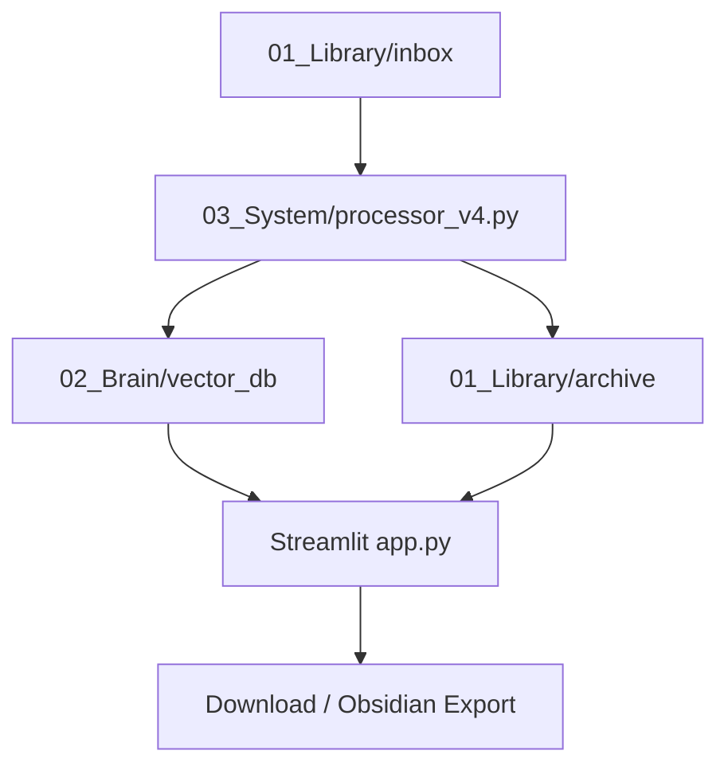

# Theology AI Lab 기술 명세서 (Local Edition)

## 1. 설계 원칙

공유 배포판의 기준선을 로컬 우선 구조로 고정합니다.

- Colab 기본 의존 제거
- Google Drive 동기화 기본 의존 제거
- 앱, 인덱서, archive, ChromaDB를 한 프로젝트 폴더 안에 배치
- 설치/실행 스크립트와 `pyproject.toml`을 배포 기준으로 정리

## 2. 아키텍처


```mermaid
flowchart TD
    Inbox[01_Library/inbox] --> Processor[03_System/processor_v4.py]
    Processor --> Archive[01_Library/archive]
    Processor --> Chroma[02_Brain/vector_db]
    Chroma --> App[Streamlit app.py]
    Archive --> App
    App --> Export[Download / Obsidian Export]
```

## 3. 주요 컴포넌트

| 영역 | 파일/기술 | 역할 |
| --- | --- | --- |
| UI | Streamlit `app.py` | 검색, Inbox 관리, 설정, Obsidian 내보내기 |
| 인덱서 | `processor_v4.py` | PDF/EPUB/TXT 추출, 청킹, 임베딩, ChromaDB 저장 |
| 청킹 | `pipeline/semantic_chunker.py` | 문서 유형별 구조 기반 청킹 |
| 임베딩 | `pipeline/embedder.py` | BAAI/bge-m3 기반 로컬 임베딩 |
| 검색 | `utils/dual_search.py` | ChromaDB + archive JSON 이중 검색 |
| 저장 | ChromaDB + JSON | 벡터 검색과 재인덱싱 재료 분리 보존 |

## 4. 저장소 경로

```text
01_Library/inbox       # 처리 대기 파일
01_Library/archive     # 청킹 JSON 아카이브
02_Brain/vector_db     # ChromaDB
03_System/venv         # 로컬 Python 가상환경
```

## 5. 의존성

Python 패키지는 `03_System/pyproject.toml`에 고정합니다.

핵심 의존성:

- `streamlit`
- `chromadb`
- `langchain-chroma`
- `sentence-transformers`
- `torch`
- `pymupdf`
- `pytesseract`, `pdf2image`, `pillow`
- `anthropic`, `openai`, `google-genai`

스캔 PDF OCR은 별도의 시스템 Tesseract 설치가 필요할 수 있습니다.

## 6. 배포 상태

이 문서는 Local Edition의 동결 기준입니다. Cloud/Colab 흐름은 기본 배포 경로가 아닙니다.
